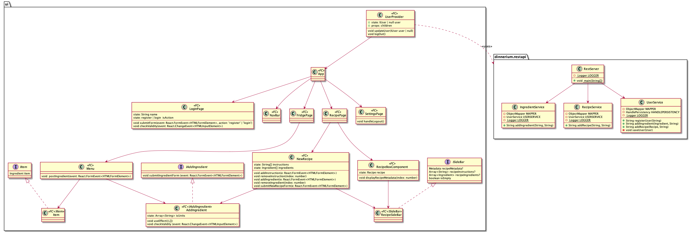
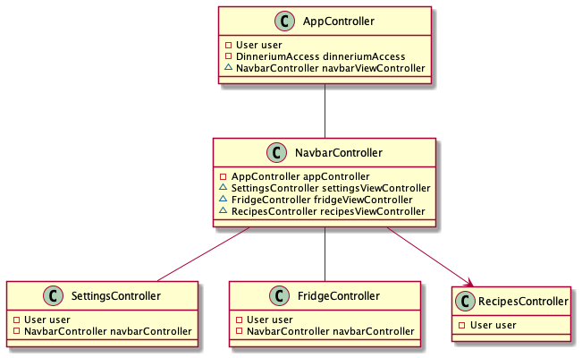

## Pakkediagram

Et pakkediagram for applikasjonen våres. Fxui og ui representerer henholdsvis JavaFX og React-applikasjonene. Hele ui er avhengig av restapi, som igjen er avhengig av core.

## Klassediagram for core og restapi

Dette klassediagrammet er en oversikt over klassene i core- og restapi-modulene. Det viser hvordan de to modulene henger sammen,
og hvilke klasser som har assosiasjoner til hverandre.

## Klassediagram for ui og restapi

Dette klassediagrammet viser hvordan komponentene i [React](../../ui) er bundet sammen, fra topp til bunn. Det blir ett litt annet prinsipp enn fra det vi kjenner fra Java-klassediagrammer. Tanken er at UserProvider er den komponenten som snakker med restapi og wrapper en useContext rundt hele App-komponenten. Dette gjør at via kan tiltale vår UserProvider komponent som en lags rot-komponent til alle de andre. Ettersom App er et children av UserProvider.

## Klassediagram for fxui

Dette er en oversikt over [fxui-modulen](../../dinnerium/fxui) med de tilhørende kontrollerne og fxml-arkene.
Diagrammet viser hvordan kontrollerne henger sammen.

## Sekvensdiagram

Sekvensdiagrammet viser et typisk bruksscenario hvor en bruker registerer seg og legger til en ingrediens i kjøleskapet.
Det viser også hvordan flyten går ved REST kall.

