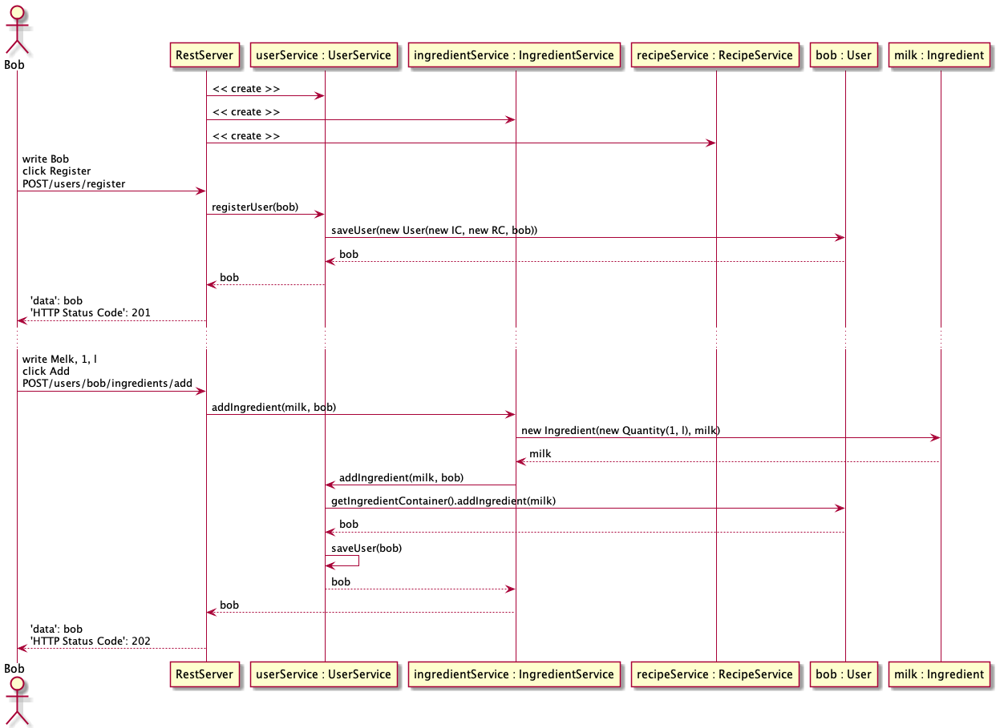

## Pakkediagram

Et pakkediagram for applikasjonen våres. Fxui og ui representerer henholdsvis JavaFX og React-applikasjonene.

## Klassediagram for core og restapi

Dette klassediagrammet er en oversikt over klassene i core- og restapi-modulene. Det viser hvordan de to modulene henger sammen,
og hvilke klasser som har assosiasjoner til hverandre.

## Sekvensdiagram

Sekvensdiagrammet viser et typisk bruksscenario hvor en bruker registerer seg og legger til en ingrediens i kjøleskapet.
Det viser også hvordan flyten går ved REST kall.

## Klassediagram for fxui

Dette er en oversikt over [fxui-modulen](../../dinnerium/fxui) med de tilhørende kontrollerne og fxml-arkene.
Diagrammet viser hvordan kontrollerne henger sammen.

